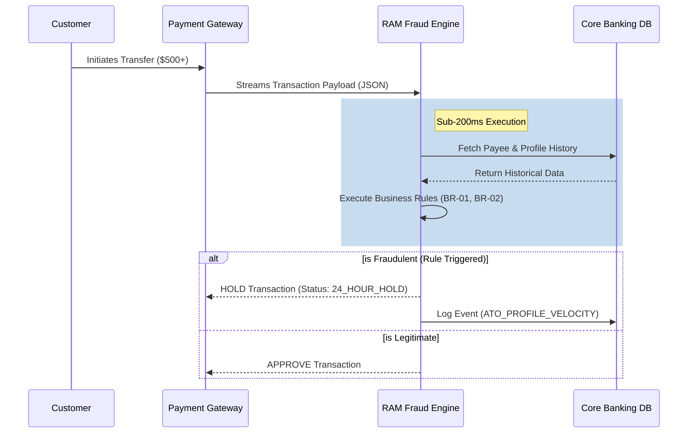

# 🏗️ Process Modeling: To-Be Architecture

## Real-Time Engine Sequence Diagram
The following sequence diagram outlines the real-time data flow and decision logic of the `RAM` fraud engine. The system is constrained by a strict Non-Functional Requirement (NFR) to execute this entire loop in under 200 milliseconds to prevent payment gateway timeouts.

